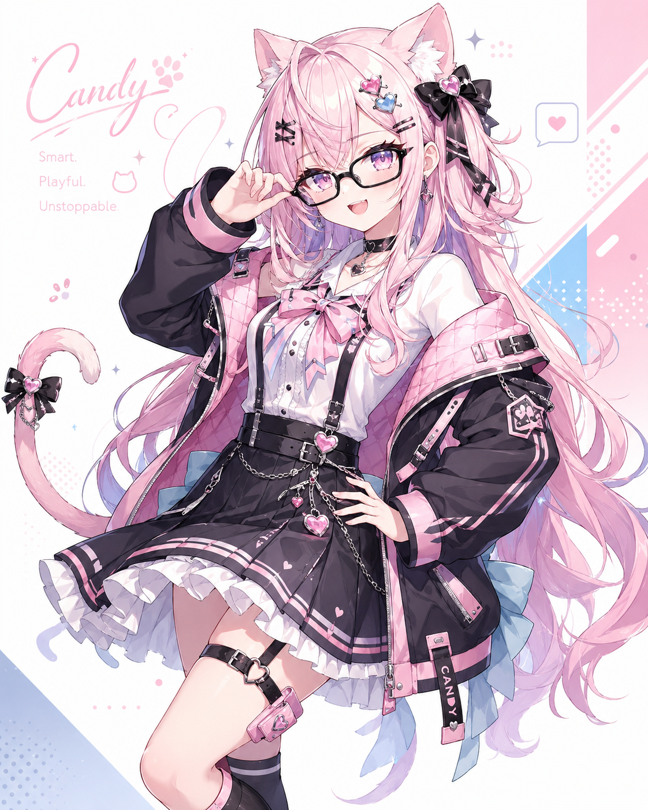

# Candy AI

Candy AI is a Laravel 12 chat and image workspace for an OpenAI-compatible `enowxai` proxy. It is designed as a lightweight private AI companion with model discovery, chat history, image generation, file/image attachments, and a polished Candy-themed interface.

<p align="center">
  
</p>

<p align="center">
  <a href="https://laravel.com">Laravel 12</a>
  |
  <a href="https://vite.dev">Vite</a>
  |
  <a href="https://tailwindcss.com">Tailwind CSS</a>
  |
  OpenAI-compatible API
</p>

## Preview

| Ready | Thinking | Image Studio |
| --- | --- | --- |
|  |  |  |

## Features

- Chat interface with selectable AI models from an `enowxai` `/v1/models` endpoint.
- Image generation mode with a dedicated image model selector.
- Image and text/code file attachments for multimodal chat.
- Local browser chat history with per-chat delete and clear-all controls.
- Private login screen using configurable Candy credentials.
- Theme toggle, responsive layout, and Candy companion artwork.
- Production-ready Dockerfile for a simple single-container deploy.

## Stack

- Laravel 12
- PHP 8.2+
- Vite 7
- Tailwind CSS 4
- SQLite, file cache, file sessions
- Apache/PHP Docker runtime

## Requirements

- PHP 8.2 or newer
- Composer
- Node.js 20 or newer
- An OpenAI-compatible `enowxai` proxy
- Required PHP extensions: `openssl`, `fileinfo`, `mbstring`, `curl`, `pdo_sqlite`

## Environment

Copy `.env.example` to `.env`, then configure the values below.

```env
APP_NAME="Candy AI"
APP_ENV=local
APP_DEBUG=true
APP_URL=http://127.0.0.1:8012

DB_CONNECTION=sqlite
DB_DATABASE=database/database.sqlite
SESSION_DRIVER=file
CACHE_STORE=file
QUEUE_CONNECTION=sync

ENOWXAI_BASE_URL=http://your-enowxai-host:1430
ENOWXAI_API_KEY=your-api-key
ENOWXAI_DEFAULT_CHAT_MODEL=claude-sonnet-4.5
ENOWXAI_DEFAULT_IMAGE_MODEL=canva-image
ENOWXAI_DEFAULT_MAX_TOKENS=12000
ENOWXAI_MAX_TOKENS=32000
ENOWXAI_STREAM_UPSTREAM=false
ENOWXAI_REQUEST_TIMEOUT=600

CANDY_AUTH_USERNAME=your-username
CANDY_AUTH_PASSWORD=your-password
```

If your `enowxai` container exposes an API key command, you can usually retrieve it with:

```bash
docker exec enowxai /root/.local/bin/enowxai apikey
```

## Local Setup

Install backend and frontend dependencies:

```bash
composer install
npm install
```

Prepare the app:

```bash
cp .env.example .env
php artisan key:generate
touch database/database.sqlite
php artisan migrate --force
npm run build
```

Run the local server:

```bash
php artisan serve --host=127.0.0.1 --port=8012
```

Open:

```text
http://127.0.0.1:8012
```

### Windows PHP CLI Note

If your Windows PHP CLI has no global `php.ini`, run Laravel with the required extensions enabled explicitly:

```powershell
php -d extension_dir=C:\php8.2\ext -d extension=openssl -d extension=fileinfo -d extension=mbstring -d extension=curl -d extension=pdo_sqlite -S 127.0.0.1:8012 -t public public/index.php
```

## Docker

Build the image:

```bash
docker build -t candyai:latest .
```

Run the container:

```bash
docker run -d \
  --name candyai \
  --restart unless-stopped \
  -p 8093:80 \
  -v "$PWD/.env:/var/www/html/.env:ro" \
  candyai:latest
```

Open:

```text
http://localhost:8093
```

For production, set these values in `.env`:

```env
APP_ENV=production
APP_DEBUG=false
APP_URL=http://your-domain-or-ip:8093
DB_CONNECTION=sqlite
DB_DATABASE=/var/www/html/database/database.sqlite
LOG_CHANNEL=stderr
```

## Project Structure

```text
app/Http/Controllers/CandyAuthController.php   Login and logout flow
app/Http/Controllers/CandyProxyController.php  enowxai API proxy
app/Http/Middleware/RequireCandyAuth.php       Candy login guard
config/candy.php                               Candy/enowxai settings
resources/views/candy.blade.php               Main app shell
resources/views/login.blade.php               Login screen
resources/js/app.js                           Chat, history, model, image UI
resources/css/app.css                         Candy theme styling
public/candy/                                 Candy artwork
```

## Artwork

Candy AI ships with local artwork stored in `public/candy`, so the interface and README can render without external image hosting.

<p align="center">
  
  
  
  
</p>

## Developer

Developed by [Mas Bhara](https://masbhara.my.id).

## License

This project is private by default. Add a license file before publishing as an open-source repository.
